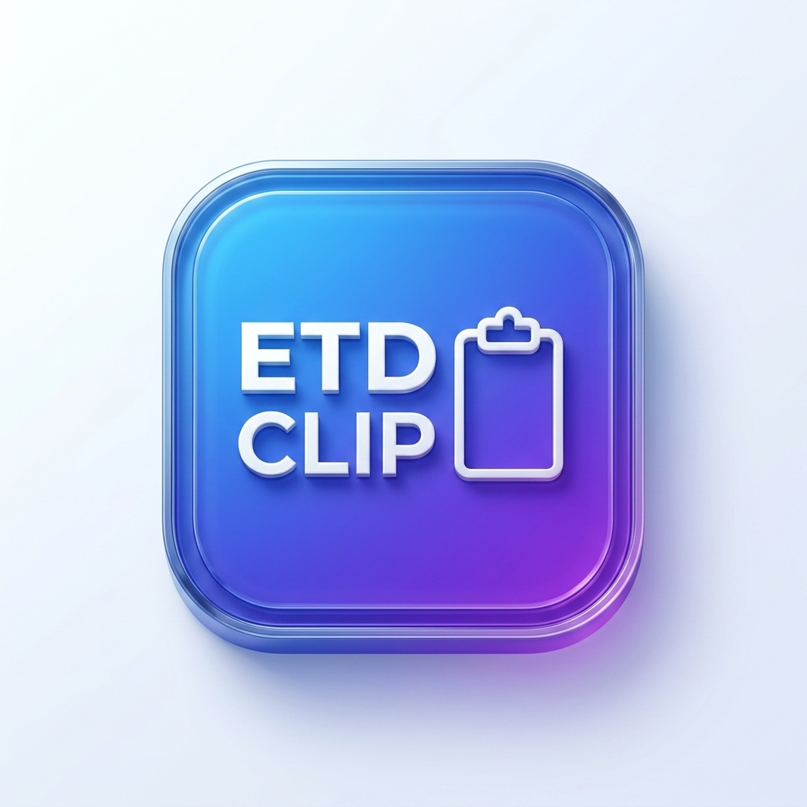

    
  <b>ETDClip</b> — Modern  Clipboard Manager for Windows 
  Created by Emir Tuğra Dağ • Built with Gemini 3.6 Flash on Google Antigravity

  <a href="#-türkçe"><b>🇹🇷 Türkçe</b></a> &nbsp;|&nbsp; 
  <a href="#-english"><b>🇬🇧 English</b></a> &nbsp;|&nbsp; 
  <a href="https://github.com/emirtugra-dag/ETDClip/releases/download/v1.0.2/ETDClipSetup.exe"><b>📥 Download Setup (.exe)</b></a>

---

## 🇹🇷 Türkçe

### Genel Bakış
ETDClip, Windows işletim sistemi için geliştirilmiş modern arayüze, akıllı mükerrer kopyalama korumasına, silinmeye karşı önbellekleme sistemine ve aşırı düşük bellek kullanımına sahip modern bir pano yöneticisidir.

### Öne Çıkan Özellikler
- **Modern ve Şeffaf Arayüz**: Yarı şeffaf paneller ve modern, minimalist tasarım.
- **Akıllı Pano Geçmişi**: Konfigüre edilebilir geçmiş takibi (maksimum 50 öğeye kadar). Aynı öğe tekrar kopyalandığında mükerrer kayıt oluşturmaz, zaman damgasını güncelleyerek en üste taşır.
- **Özelleştirilebilir Kısayol**: Varsayılan olarak `Alt+V` kısayolu ile açılır ve kapanır. Ayarlar panelinden istediğiniz kısayol kombinasyonunu kaydedebilirsiniz.
- **Gelişmiş Dosya Önbellekleme**: Belirttiğiniz boyuttan (maksimum 1024 MB / 1 GB) küçük dosyalar otomatik diske önbelleğe alınır. Böylece orijinal dosya silinse bile geçmişten tekrar kopyalayabilirsiniz. Geçmişten silinen öğelerin önbelleği de diskten otomatik temizlenir.
- **Sistem Tepsisi (System Tray) Entegrasyonu**: Kapatıldığında arka planda yaşamaya devam eder. Tepsi simgesine sağ tıklayarak açabilir, geçmişi temizleyebilir veya çıkış yapabilirsiniz.
- **Açık / Koyu / Sistem Teması**: Açık ve Koyu tema geçişlerinin yanı sıra, Windows sistem ayarınıza göre temanın otomatik olarak güncellenmesini sağlayan "Sistem Varsayılanı" moduna sahiptir.
- **Çoklu Dil Desteği**: Uygulama ve kurulum ekranı içerisinden tek tıkla Türkçe veya İngilizce seçimi.

### Kurulum
Hazır derlenmiş kurulum dosyasını indirip çalıştırabilirsiniz:  
👉 **[ETDClipSetup.exe İndir](https://github.com/emirtugra-dag/ETDClip/releases/download/v1.0.2/ETDClipSetup.exe)**

### Sistem Gereksinimleri
- **İşletim Sistemi**: Windows 10 (Sürüm 1809+) veya Windows 11 (64-bit)
- **RAM**: Minimum 30 MB (Arka planda ~15 MB)
- **Disk**: ~350 MB (Self-contained, ek .NET yüklemesi gerektirmez)

### Yasal Bildirim, Telif Hakkı ve Sorumluluk Reddi

1. **Geliştirici ve Bağımsız Proje Bildirimi**:
   ETDClip, herhangi bir şirket, kurum veya ticari kuruluşla bağlantısı olmayan, bireysel bağımsız geliştirici **Emir Tuğra Dağ** tarafından yapay zeka teknolojileri (Google Antigravity platformunda Gemini 3.6 Flash) yardımıyla geliştirilmiş kişisel bir projedir.

2. **Marka, İsim ve Görsel Varlıkların Korunması**:
   Projenin kaynak kodları MIT Lisansı altındadır. Ancak **"ETDClip" ismi, logosu (`Assets/etdclip_logo.png`) ve uygulama simgeleri (`Assets/app.ico`)** bağımsız geliştirici Emir Tuğra Dağ'ın kişisel fikri mülkiyetidir. Yazılı izin alınmadan bu isim, logo veya görseller başka bir projede kullanılamaz, dağıtılamaz, değiştirilemez veya ticari/bireysel olarak kopyalanamaz.

3. **Eksiksiz Sorumluluk Reddi (DISCLAIMER OF LIABILITY)**:
   BU YAZILIM MIT LİSANSI HÜKÜMLERİNE UYGUN OLARAK **"OLDUĞU GİBİ" (AS IS)** VE HERHANGİ BİR AÇIK VEYA ZIMNİ GARANTİ OLMAKSIZIN SUNULMAKTADIR. YAZILIMIN KULLANIMINDAN VEYA KULLANILAMAMASINDAN, VERİ KAYIPLARINDAN, SİSTEM KESİNTİLERİNDEN VEYA OLUŞABİLECEK HERHANGİ BİR DOĞRUDAN/DOLAYLI ZARARDAN GELİŞTİRİCİ (EMİR TUĞRA DAĞ) HİÇBİR KOŞULDA YASAL VEYA HUKUKİ OLARAK SORUMLU TUTULAMAZ. TÜM KULLANIM VE RİSK TAMAMEN KULLANICIYA AİTTİR.

4. **Geliştirme ve Destek Taahhütsüzlüğü**:
   Geliştiricinin projeye teknik destek sağlama, hataları düzeltme veya yeni sürüm çıkarma gibi hiçbir zorunluluğu veya taahhüdü yoktur. Geliştirici, projenin bakımını veya geliştirilmesini herhangi bir bildirim yapmaksızın dilediği zaman tamamen durdurma hakkını saklı tutar.

5. **Gizlilik**: ETDClip %100 çevrimdışı (offline) çalışır. Hiçbir pano verisi veya kullanıcı bilgisi sunuculara aktarılmaz.

---

## 🇬🇧 English

### Overview
ETDClip is a high-performance and modern Clipboard Manager for Windows designed for simplicity, smart deduplication, offline privacy, and ultra-low background memory footprint.

### Key Features
- **Modern & Transparent UI**: Translucent slate panels with a modern, clean, minimalist layout.
- **Smart History**: Retains clipboard items (configurable up to 50 items) with timestamp deduplication.
- **Customizable Hotkey**: Opens and hides using the default `Alt+V` shortcut. Easily record your preferred hotkey combination in settings.
- **Advanced File Caching**: Automatically caches files smaller than the specified limit (up to 1024 MB / 1 GB). Reclaims files even if the original is deleted. Deleting items from history automatically purges their cached files from disk.
- **System Tray Integration**: Stays active in the background when closed. Open the window, clear history, or exit using the system tray context menu.
- **Light / Dark / System Theme**: Toggle between Light and Dark themes, or select "System Default" to dynamically follow Windows settings.
- **Bilingual Interface**: Switch seamlessly between Turkish and English in settings and setup wizard.

### Download & Installation
Download the pre-compiled setup installer:  
👉 **[Download ETDClipSetup.exe](https://github.com/emirtugra-dag/ETDClip/releases/download/v1.0.2/ETDClipSetup.exe)**

### System Requirements
- **OS**: Windows 10 (Build 1809+) or Windows 11 (64-bit)
- **RAM**: Min 30 MB (Background ~15 MB)
- **Disk**: ~350 MB (Self-contained, no extra runtimes required)

### Legal Notice, Copyright & Liability Disclaimer

1. **Developer & Independent Project Statement**:
   ETDClip is a personal project created by independent developer **Emir Tuğra Dağ**, built with AI assistance (Gemini 3.6 Flash on Google Antigravity). It is not affiliated with any company, corporation, or commercial entity.

2. **Protection of Name, Brand & Visual Assets**:
   While the source code is licensed under the MIT License, the **"ETDClip" name, logo artwork (`Assets/etdclip_logo.png`), and icon assets (`Assets/app.ico`)** are the personal intellectual property of Emir Tuğra Dağ. They may NOT be used, copied, re-distributed, modified, or re-branded in any third-party project without explicit prior written consent from Emir Tuğra Dağ.

3. **Absolute Disclaimer of Liability (AS IS)**:
   THE SOFTWARE IS PROVIDED **"AS IS"**, WITHOUT WARRANTY OF ANY KIND, EXPRESS OR IMPLIED, INCLUDING BUT NOT LIMITED TO THE WARRANTIES OF MERCHANTABILITY, FITNESS FOR A PARTICULAR PURPOSE AND NONINFRINGEMENT. IN NO EVENT SHALL THE AUTHOR (EMİR TUĞRA DAĞ) BE LIABLE FOR ANY CLAIM, DAMAGES, DATA LOSS, SYSTEM INSTABILITY, OR OTHER LIABILITY, WHETHER IN AN ACTION OF CONTRACT, TORT OR OTHERWISE, ARISING FROM, OUT OF OR IN CONNECTION WITH THE SOFTWARE OR THE USE OR OTHER DEALINGS IN THE SOFTWARE. ALL RISKS BELONG ENTIRELY TO THE USER.

4. **No Obligation for Maintenance or Support**:
   The developer has no obligation or commitment to provide technical support, bug fixes, or future updates. The developer reserves the right to cease development, maintenance, or updates at any time without prior notice.

5. **Privacy**: Runs 100% locally. Zero telemetry or server data transmission.
